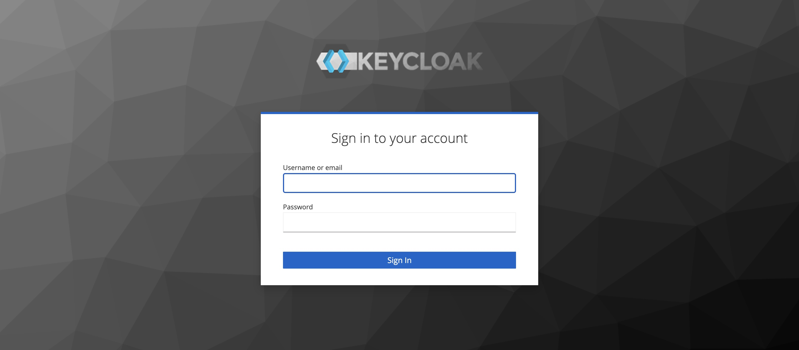

### 登入系統

#### 登入步驟

1. **打開瀏覽器**：在瀏覽器中輸入 iPOC 的 URL 地址，例如 `https://10.99.1.123`。
2. **重定向至登入頁面**：您將會被重定向到 `https://10.99.1.123:8443`，這是 Keycloak 的登入頁面。
3. **輸入憑證**：在 Keycloak 登入頁面，輸入您的使用者名稱和密碼，然後點擊登入按鈕。
4. **驗證成功**：如果憑證正確，您將被重定向回 `https://10.99.1.123`，並顯示 iPOC 的主頁面，可以開始使用各種功能。

#### 登入頁面截圖

#### 注意事項

- 確保您的帳號和密碼是正確的，如果忘記密碼，請聯繫系統管理員重置。
- 確保您已經在 Keycloak 中註冊並擁有訪問 iPOC 的權限。
- 如果您遇到登入問題，請檢查網絡連接是否正常，或聯繫系統管理員獲取幫助。