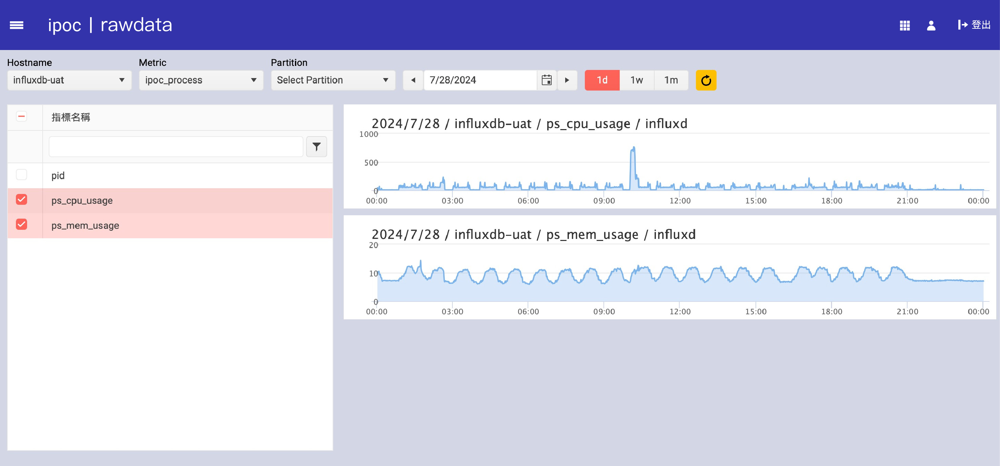

# RawData

## 功能介紹
RawData 功能用於顯示伺服器的原始性能數據，用戶可以選擇不同的主機、度量指標和分區來查看具體的性能數據。這些數據有助於進行詳細的性能分析和故障排查。

## 操作指南

### 查看原始數據
1. 在 "Hostname" 下拉選單中選擇伺服器名稱。
2. 在 "Metric" 下拉選單中選擇需要查看的度量指標。
3. 在 "Partition" 下拉選單中選擇具體的分區（如果適用）。
4. 使用日期選擇器選擇所需的日期範圍。
5. 點擊刷新按鈕以更新數據顯示。

### 篩選指標
1. 在左側的 "指標名稱" 列表中，使用搜尋框快速找到所需的指標。
2. 選中所需的指標名稱以顯示對應的數據。

## 圖片示例

