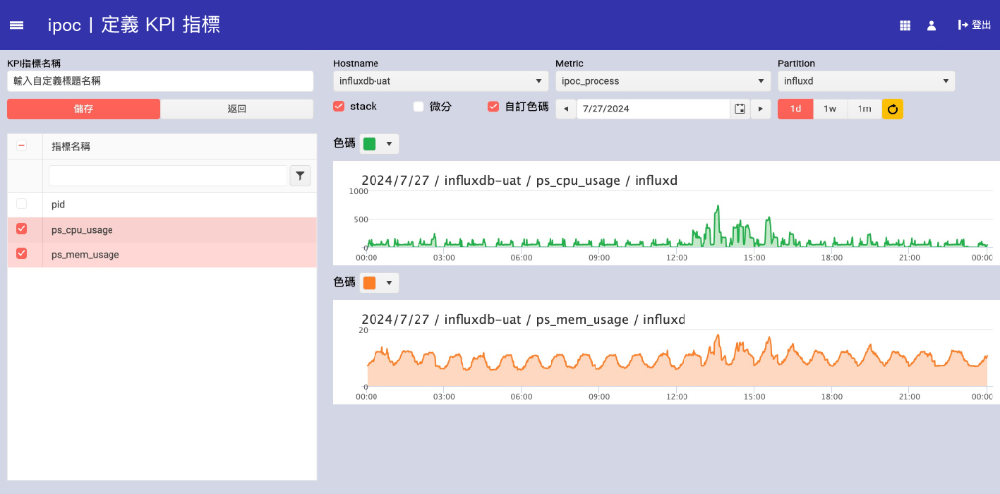
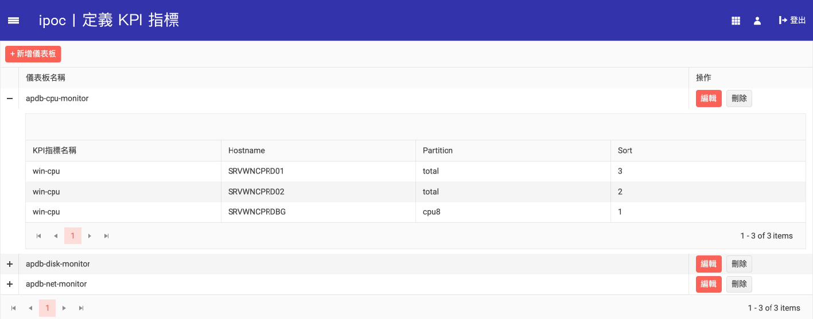

### 定義KPI指標.md

在iPOC系統中，您可以自定義KPI指標來監控系統和應用程序的性能。以下是定義KPI指標的操作步驟：

#### 1. 進入定義KPI指標頁面
登入iPOC系統後，從左側選單中選擇「指標自選區」->「定義KPI指標」。

#### 2. 新增KPI指標
在KPI指標設定頁面，點擊「新增KPI指標」按鈕，進入KPI指標的編輯頁面。

#### 3. 填寫KPI指標資訊
在編輯頁面中，您需要填寫以下資訊：

- **KPI指標名稱**：輸入自定義的KPI指標名稱。
- **Hostname**：從下拉選單中選擇要監控的主機名。
- **Metric**：從下拉選單中選擇要監控的指標，如cpu_usage、mem_usage等。
- **Partition**：選擇要監控的分區。
- **Stack**：選擇是否堆疊顯示。
- **微分**：選擇是否微分顯示。
- **自訂色碼**：選擇是否使用自訂色碼。
- **時間範圍**：選擇要監控的時間範圍，如1d、1w、1m等。

#### 4. 查看和編輯已定義的KPI指標
定義完KPI指標後，您可以在KPI指標列表頁面查看和編輯已定義的KPI指標。點擊「編輯」按鈕可以對KPI指標進行修改，點擊「刪除」按鈕可以刪除不需要的KPI指標。

#### 5. 保存設定
填寫完所有必需資訊後，點擊「保存」按鈕，完成KPI指標的定義。點擊「返回」按鈕可以返回KPI指標列表頁面。

#### 注意事項
- 定義的KPI指標將在相關儀表板中顯示，方便您監控和分析系統性能。
- 確保所有設定正確無誤，避免因設定錯誤導致的監控數據異常。