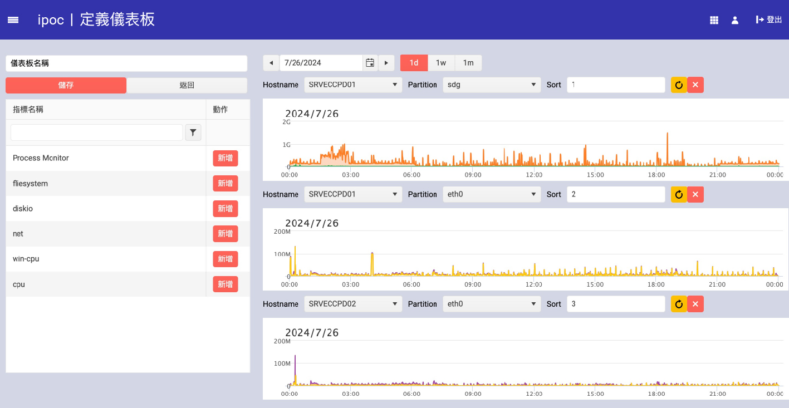
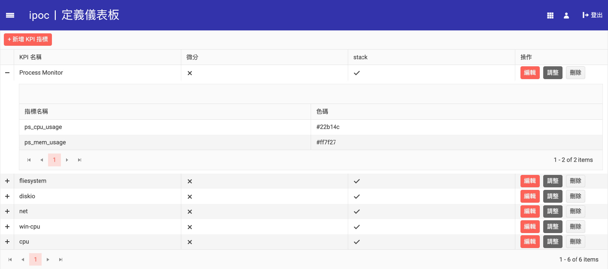

### 定義儀表板

在 iPOC 中，您可以自定義和管理儀表板來展示各種效能數據。以下將介紹如何在系統中定義和管理儀表板。

#### 1. 新增儀表板
1. **進入儀表板設定界面**
    - 點擊左側選單中的 "指標自選區"，然後選擇 "定義儀表板"。
    - 您將看到所有已定義的儀表板列表。

2. **新增儀表板**
    - 點擊 "新增儀表板" 按鈕。
    - 在彈出的表單中填寫儀表板名稱。

3. **添加KPI指標**
    - 在 "KPI指標" 欄位中，選擇您想要展示的KPI指標。這些指標可以是在 "定義KPI指標" 中設置的各種效能數據。
    - 每個KPI指標可以設置不同的顏色和排序順序。

4. **設置其他選項**
    - 設置其他選項如是否微分和是否堆疊顯示。
    - 您可以根據需求調整這些參數來達到最佳顯示效果。

5. **保存設置**
    - 完成所有設置後，點擊 "保存" 按鈕以保存新建的儀表板。

#### 2. 編輯和刪除儀表板
1. **編輯儀表板**
    - 在儀表板列表中找到需要編輯的儀表板，點擊 "編輯" 按鈕。
    - 在彈出的編輯界面中，修改儀表板的相關設置。
    - 保存修改。

2. **刪除儀表板**
    - 在儀表板列表中找到需要刪除的儀表板，點擊 "刪除" 按鈕。
    - 系統會彈出確認對話框，確認後儀表板將被刪除。

#### 圖示示例
- **新增儀表板界面**
    - 

- **儀表板列表界面**
    - 

通過上述步驟，您可以在 iPOC 中靈活地定義和管理儀表板，以滿足不同場景下的效能數據展示需求。