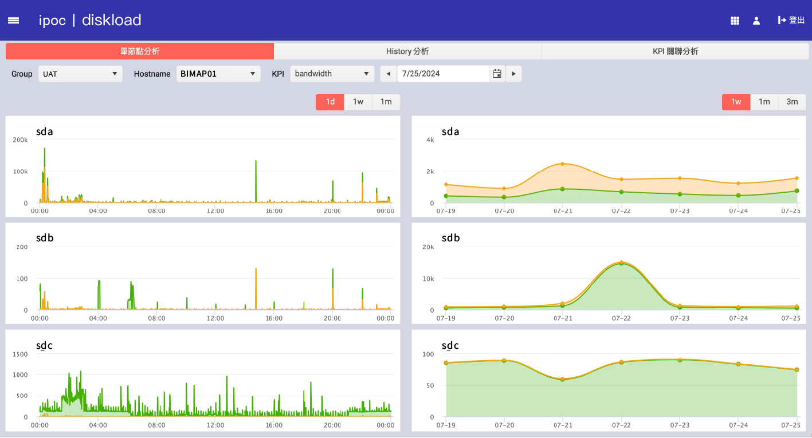
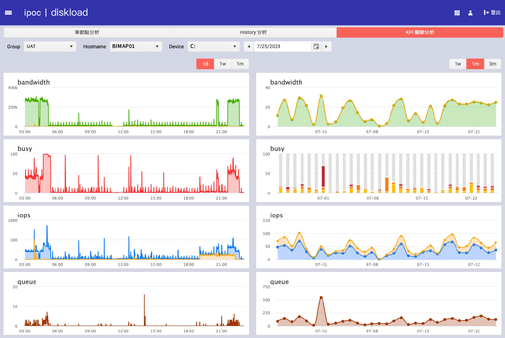

# Diskload 分析

Diskload 分析提供多種維度的磁碟負載分析，包括單節點分析、歷史分析和 KPI 關聯分析，幫助用戶全面了解磁碟使用情況，優化系統性能。

## 單節點分析

單節點分析頁面顯示選定節點的磁碟帶寬、忙碌程度（busy）、IOPS 和隊列長度等關鍵指標。

### 範例圖表

- **Group**：選擇要分析的群組。
- **Hostname**：選擇要分析的主機名稱。
- **Device**：選擇要分析的設備。
- **KPI**：選擇要分析的關鍵指標。
- **日期選擇器**：選擇要分析的日期範圍。

### 指標說明

- **bandwidth**：磁碟帶寬使用情況。
- **busy**：磁碟忙碌程度。
- **iops**：每秒 I/O 操作數。
- **queue**：I/O 操作隊列長度。

## History 分析

歷史分析頁面顯示選定節點在特定時間範圍內的磁碟帶寬、忙碌程度、IOPS 和隊列長度等關鍵指標的歷史趨勢。

### 範例圖表

- **Group**：選擇要分析的群組。
- **Hostname**：選擇要分析的主機名稱。
- **Device**：選擇要分析的設備。
- **KPI**：選擇要分析的關鍵指標。
- **日期選擇器**：選擇要分析的日期範圍。

### 指標說明

- **bandwidth**：磁碟帶寬使用情況。
- **busy**：磁碟忙碌程度。
- **iops**：每秒 I/O 操作數。
- **queue**：I/O 操作隊列長度。

## KPI 關聯分析

KPI 關聯分析頁面顯示多個 KPI 在選定時間範圍內的關聯趨勢，幫助用戶發現潛在問題和性能瓶頸。

### 範例圖表

- **Group**：選擇要分析的群組。
- **Hostname**：選擇要分析的主機名稱。
- **KPI**：選擇要分析的關鍵指標。
- **日期選擇器**：選擇要分析的日期範圍。

### 指標說明

- **bandwidth**：磁碟帶寬使用情況。
- **busy**：磁碟忙碌程度。
- **iops**：每秒 I/O 操作數。
- **queue**：I/O 操作隊列長度。