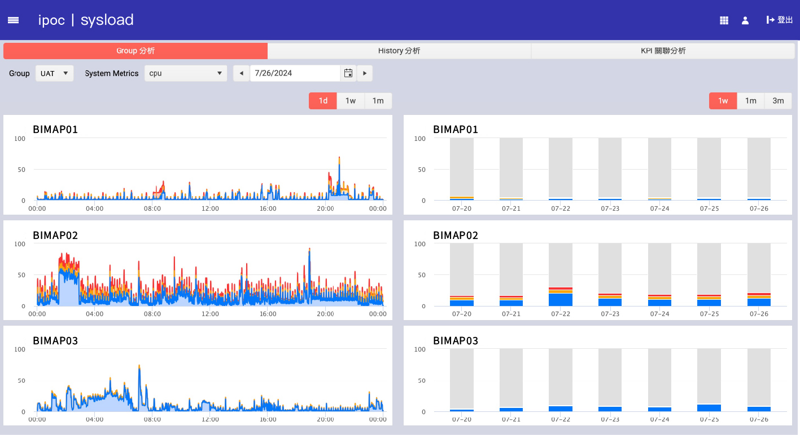
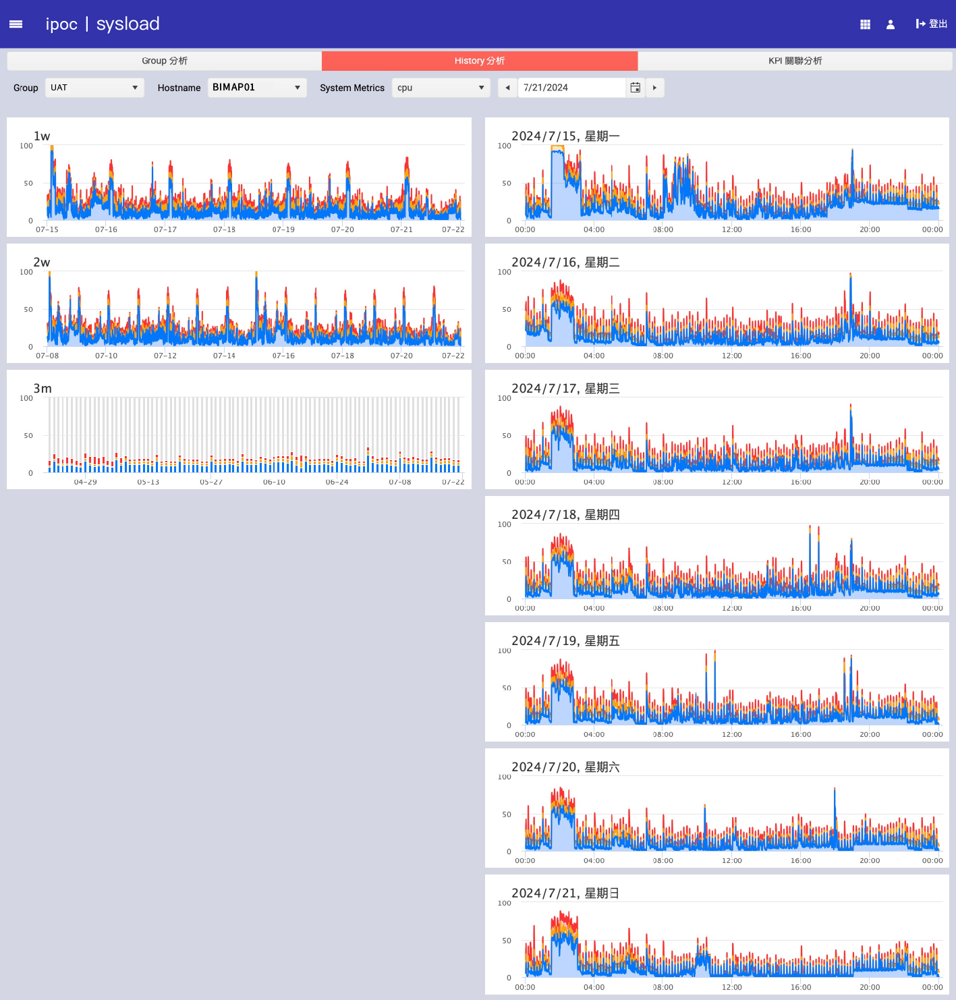
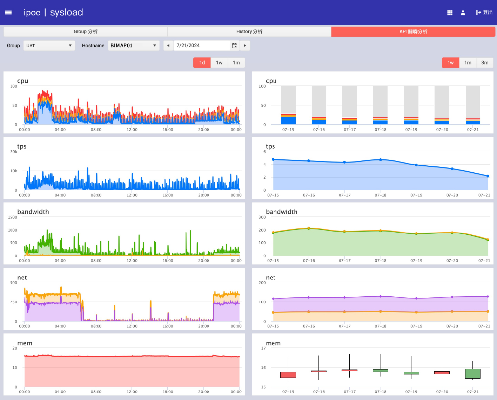

# 系統關聯分析 - Sysload

本頁面展示系統 CPU、TPS、帶寬、網絡和內存的歷史數據及其關聯性。用戶可以根據不同的系統指標和時間段來分析系統性能。

## Group 分析

在 Group 分析中，您可以選擇特定的群組和主機，然後選擇要分析的系統指標。系統將生成選定時間段內的歷史數據圖表，展示各個指標的變化趨勢。

## History 分析

在 History 分析中，您可以選擇特定的主機和時間段，然後選擇要分析的系統指標。系統將生成過去一周、一個月和三個月內的歷史數據圖表，展示各個指標的變化趨勢。

## KPI 關聯分析

在 KPI 關聯分析中，您可以選擇特定的群組和主機，然後選擇要分析的系統指標。系統將生成選定時間段內的多個 KPI 指標的變化趨勢圖，幫助用戶分析不同指標之間的關聯性。

## 使用說明

1. **選擇群組和主機**：在頁面頂部選擇需要分析的群組和主機。
2. **選擇系統指標**：從下拉選單中選擇要分析的系統指標（如 CPU、TPS、帶寬等）。
3. **選擇時間段**：選擇要分析的時間段（日、周、月）。
4. **查看圖表**：系統將自動生成選定時間段內的歷史數據圖表。

## 注意事項

- 確保所選時間段內有足夠的數據，以便進行有效的分析。
- 根據需要調整時間段和指標，以獲得更多詳細的信息和洞見。