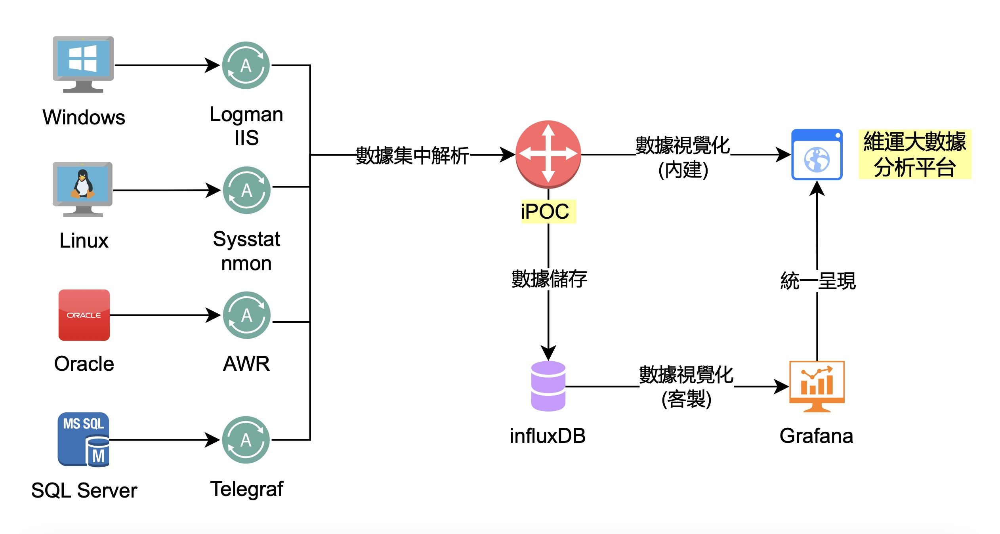

# 產品架構

本圖展示了 iPOC 的整體架構，從數據收集到數據可視化的流程。

## 說明

1. **數據收集**：iPOC 支持多種數據收集方式，包括：
    - Windows：使用 Logman IIS 收集數據
    - Linux：使用 Sysstat 和 nmon 收集數據
    - Oracle：使用 AWR 收集數據
    - SQL Server：使用 Telegraf 收集數據

2. **數據解析與儲存**：
    - 收集到的數據會經過集中解析，然後儲存在 InfluxDB 中。

3. **數據可視化**：
    - iPOC 內建的數據視覺化平台可以展示數據。
    - 同時，數據也可以透過 Grafana 進行視覺化呈現。

這樣的架構確保了數據從收集、解析到儲存和視覺化的完整流程，提供用戶一站式的數據管理和監控解決方案。